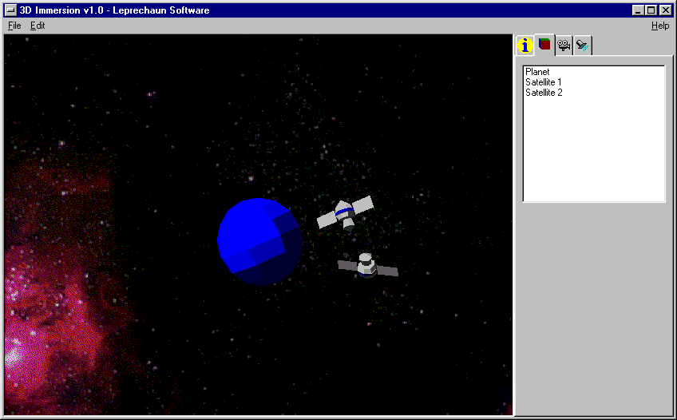

# 3D-Immersion
From the time before hardware graphics acceleration and Direct X, my 1998 Science Fair entry, 3d Immersion, a dynamic virtual reality simulator with programmable objects via the dynamic link library (DLL) interface.

Features:
- Custom object format and *convert* utility application
- Custom 3D library
- Sample worlds and dynamic programming examples
   - Kepler Celestial Body Attraction Simulation (COMPLETE)
   - Vehicle Simulation  
   - Fear of Heights - Open Elevator Simulator (COMPLETE)  
   - Diagnostic World  
   - Space Invaders  
   - Interactive demo 

